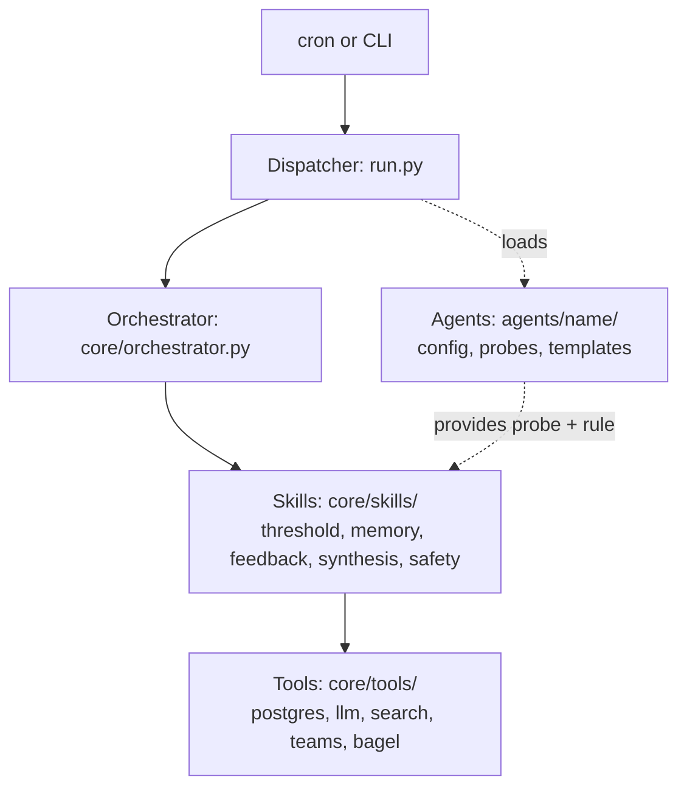
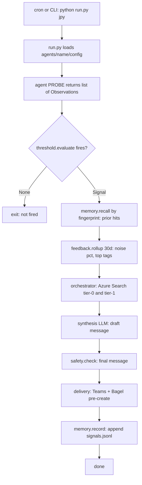
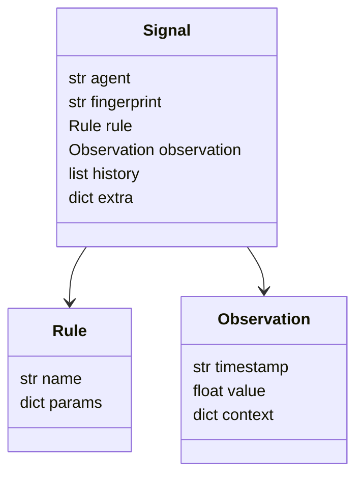
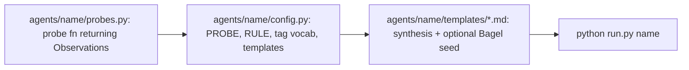

# Architecture

Living reference for the `asset-agents` system. Update this file when layers, contracts, or extension rules change — not when a single threshold value or copy tweak lands.

Last updated: 2026-04-23
Agents live: `jpy`


## 1. One-liner

A scheduled pipeline that reads time-series data, fires on configurable thresholds, enriches the signal with RAG over internal research, synthesizes a message, delivers to Teams and Bagel, and persists the outcome and feedback so future runs can self-calibrate.


## 2. Layer model

Four layers plus a horizontal agents track. Each layer has a strict contract, so any one can be rewritten without touching the others.



Where does new code go?

| If the file names...                                      | It belongs in           |
| --------------------------------------------------------- | ----------------------- |
| a specific asset, threshold value, or template            | `agents/<name>/`        |
| exactly one external system (Postgres, Azure OpenAI, ...) | `core/tools/`           |
| reusable logic that returns structured data               | `core/skills/`          |
| sequencing multiple skills for a single run               | `core/orchestrator.py`  |


## 3. End-to-end pipeline

One normal run, top to bottom. Memory-aware steps are the ones unique to this structure.




## 4. Data contracts

Three domain-free shapes flow through every agent. Adding a new asset class or metric never changes these.



Invariants:

- `Observation.value` is always signed. Sign carries direction, magnitude carries strength.
- `Signal.fingerprint` is the stable recall key — format `agent:pair:direction`. Same pair + same direction bucket collide on purpose so the LLM sees related history.
- `Signal.extra` holds agent-specific payload. Skills treat it as opaque.

Source: [core/models.py](../core/models.py)


## 5. Memory + feedback

Both use append-only JSONL at `audit_logs/memory/<agent>/`. The skill interface (`record`, `recall`, `rollup`) is backend-agnostic — swap to SQLite or Postgres later without touching callers.

| File            | Contents                                                                                   |
| --------------- | ------------------------------------------------------------------------------------------ |
| signals.jsonl   | one line per fire: run_id, signal, output, ts                                              |
| feedback.jsonl  | one line per feedback event: feedback_id, run_id, rating, tags, note, source, received_at  |

Ingestion surfaces:

- signals — written by `memory.record()` in the normal run path.
- feedback — CLI only for MVP: `python run.py <agent> feedback <run_id> --rating {-1,0,1} --tag T --note "..."`. Webhook sources (Teams reaction, Bagel engagement) plug in with the same schema.

How feedback is designed to influence future runs (plumbing in place, LLM injection pending — see section 8):

- `memory.recall(fingerprint)` surfaces prior hits joined with feedback.
- `feedback.rollup(agent, 30d)` summarizes recent ratings and tag frequencies.
- Both are injected as context blocks into the synthesis prompt. The LLM self-calibrates its narrative — deterministic, auditable, no hidden state.

Sources: [core/skills/memory.py](../core/skills/memory.py), [core/skills/feedback.py](../core/skills/feedback.py)


## 6. File layout

```
asset-agents/
  run.py                      dispatcher: normal run + feedback subcommand
  core/
    models.py                 Observation, Rule, Signal
    audit.py                  per-run JSON audit log
    orchestrator.py           RAG planning and query loop
    synthesis.py              LLM message synthesis
    safety.py                 content gate
    teams.py                  Teams delivery (migrating to core/tools/)
    bagel_chat.py             Bagel session pre-create (migrating to core/tools/)
    bagel_client.py           Azure Search client (migrating to core/tools/)
    tools/
      postgres.py             parameterized SQL + timeouts + safe DSN log
    skills/
      threshold.py            probe + rule -> Signal or None
      memory.py               JSONL record/recall
      feedback.py             JSONL + 30d rollup
  agents/
    jpy/
      config.py               PROBE + RULE + FEEDBACK_TAG_VOCAB + templates
      probes.py               FX probe: Postgres + mock fallback
      skills.md               system prompt for orchestrator planning LLM
      synthesis_template.md
  audit_logs/                 gitignored
    memory/
      jpy/
        signals.jsonl
        feedback.jsonl
  docs/
    architecture.md           this file
```


## 7. Extension contract — adding a new agent

Minimum-viable new agent is three files, zero core changes:



Core changes are only required if:

- The rule's metric doesn't exist yet — add one function and one entry in [core/skills/threshold.py](../core/skills/threshold.py) `_RULES`.
- The data source is a new external system — add one file in [core/tools/](../core/tools/).

Memory, feedback, delivery, and safety come free with every new agent.


## 8. Deferred / not yet built

Deliberate MVP cuts with plumbing already in place:

| Item                                                  | What's done                                               | What's missing                                                              |
| ----------------------------------------------------- | --------------------------------------------------------- | --------------------------------------------------------------------------- |
| Memory/feedback injection into synthesis prompt       | memory.recall and feedback.rollup called in run.py        | core/synthesis.py doesn't yet include them in the LLM prompt                |
| Direction-aware templates                             | Single template works for both directions                 | Template resolver dispatching on signal.extra.direction                     |
| Tools migration (teams, bagel, synthesis-LLM, search) | They work in their current locations                      | Moving to core/tools/ for consistency (cosmetic)                            |
| Rule-proposal batch job                               | Feedback tags + rollup exist                              | Async script: LLM reads feedback, proposes threshold tweaks, human approves |
| Dedup / alert-fatigue throttle                        | Memory can answer "did I fire today?"                     | skip_if_fired_within param on Rule                                          |
| Backtest mode                                         | Probes are pure functions                                 | --asof <date> flag + historical data path                                   |


## 9. Open questions / follow-ups

- Per-user feedback vs team-level? Currently `actor` is stored but not used in rollup.
- Template resolver's input surface when regime + direction + magnitude all matter?
- When memory volume crosses ~10k rows per agent, migrate JSONL to SQLite? Interface stays the same.


## Runtime essentials

Three cross-cutting behaviors that aren't covered by the layer model above but that every agent inherits.

### Compliance gate (`core/safety.py`)

Sentence-level regex filter on synthesized output. A sentence containing any of `buy`, `sell`, `recommend(s)`, `suggest(s)`, `should`, `must`, `price target`, `will reach`, or `could hit <digit>` is replaced with `[REDACTED BY SAFETY GATE]`, and the gate-triggered boolean is persisted in the audit log. Blunt by design — false positives beat false negatives for this workflow. Positioning vocabulary (`long`, `short`, `cover`) is explicitly allowed since the agent's job is to report on desk positioning factually.

### Logging

`run.py` configures root logging at startup. Our module loggers (`run`, `core.*`, `agents.*`) emit at `INFO`; third-party SDKs (`azure`, `openai`, `httpx`, `urllib3`) are pinned to `WARNING` so every line in the transcript is pipeline-meaningful. Override via `LOG_LEVEL=DEBUG`.

### Delivery — optional and graceful

Teams and Bagel delivery are both opt-in via env (`TEAMS_WEBHOOK_URL`, `BAGEL_CHAT_URL` + `BAGEL_USER_ID`). Absence = silent skip with an info log, not an error — the alert still prints locally. When Bagel creds are present, [core/bagel_chat.py](../core/bagel_chat.py) pre-creates a session and posts the agent's seed question (`BAGEL_FOLLOWUP_QUESTION` in the agent's config) with `wait=true`, so the analyst lands on a chat that already has Q and A rendered.


## Change log

One line per entry, newest first.

- 2026-04-23 — document runtime essentials (compliance gate rules, logging conventions, delivery semantics). Fix `fingerprint` format note (pair, not asset). No code changes.
- 2026-04-23 — initial doc. Tools/skills/agents layering, JSONL memory + feedback, JPY agent running end-to-end against live VM Postgres + Azure Search + Teams + Bagel.
